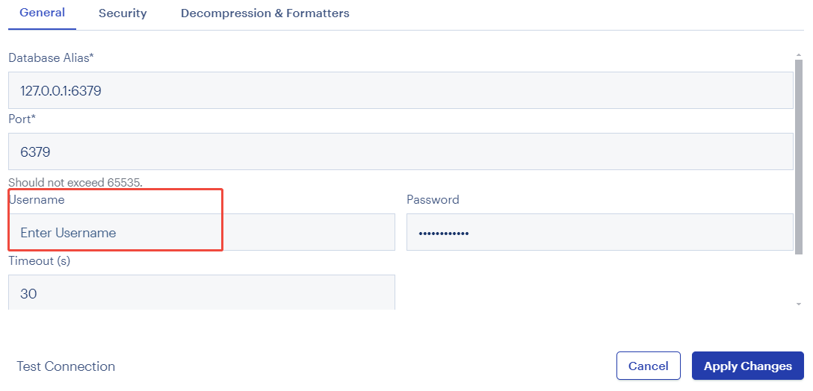
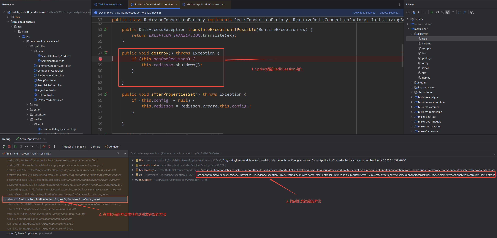

# Project starts with Error : Redisson is shutdown

## Issue

After modifying and merging codes,  project reports errors as follows;

```
***************************
APPLICATION FAILED TO START
***************************

Description:

Field mongoBaseService in net.maku.ktydata.analysis.service.impl.TaskServiceImpl required a single bean, but 9 were found:
	- mongoBaseServiceImpl: defined in file [C:\Users\24957\Projects\ktydata_serve\maku-framework\target\classes\net\maku\framework\mybatis\service\impl\MongoBaseServiceImpl.class]
	- fileCommonServiceImpl: defined in file [C:\Users\24957\Projects\ktydata_serve\business-analysis\target\classes\net\maku\ktydata\analysis\service\impl\FileCommonServiceImpl.class]
	- commonCatalogServiceImpl: defined in file [C:\Users\24957\Projects\ktydata_serve\business-common\target\classes\net\maku\ktydata\common\service\impl\CommonCatalogServiceImpl.class]
	- dispatchBusinessServiceImpl: defined in file [C:\Users\24957\Projects\ktydata_serve\business-collaboration\target\classes\net\maku\ktydata\service\impl\DispatchBusinessServiceImpl.class]
	- workflowServiceImpl: defined in file [C:\Users\24957\Projects\ktydata_serve\business-collaboration\target\classes\net\maku\ktydata\service\impl\WorkflowServiceImpl.class]
	- xtEquipmentServiceImpl: defined in file [C:\Users\24957\Projects\ktydata_serve\business-collaboration\target\classes\net\maku\ktydata\service\impl\XtEquipmentServiceImpl.class]
	- xtOccupationServiceImpl: defined in file [C:\Users\24957\Projects\ktydata_serve\business-collaboration\target\classes\net\maku\ktydata\service\impl\XtOccupationServiceImpl.class]
	- xtPostServiceImpl: defined in file [C:\Users\24957\Projects\ktydata_serve\business-collaboration\target\classes\net\maku\ktydata\service\impl\XtPostServiceImpl.class]
	- xtUserServiceImpl: defined in file [C:\Users\24957\Projects\ktydata_serve\business-collaboration\target\classes\net\maku\ktydata\service\impl\XtUserServiceImpl.class]

This may be due to missing parameter name information

Action:

Consider marking one of the beans as @Primary, updating the consumer to accept multiple beans, or using @Qualifier to identify the bean that should be consumed

Ensure that your compiler is configured to use the '-parameters' flag.
You may need to update both your build tool settings as well as your IDE.
(See https://github.com/spring-projects/spring-framework/wiki/Upgrading-to-Spring-Framework-6.x#parameter-name-retention)


2025-06-17 10:34:05.208 ERROR 13840 --- [pool-2-thread-1] n.m.s.s.impl.SysLogOperateServiceImpl    : SysLogOperateServiceImpl.saveLog Error：org.springframework.dao.InvalidDataAccessApiUsageException: Redisson is shutdown
	at org.redisson.spring.data.connection.RedissonExceptionConverter.convert(RedissonExceptionConverter.java:52)
	at org.redisson.spring.data.connection.RedissonExceptionConverter.convert(RedissonExceptionConverter.java:35)
	at org.springframework.data.redis.PassThroughExceptionTranslationStrategy.translate(PassThroughExceptionTranslationStrategy.java:40)
	at org.redisson.spring.data.connection.RedissonConnection.transform(RedissonConnection.java:209)
	at org.redisson.spring.data.connection.RedissonConnection.syncFuture(RedissonConnection.java:204)
	at org.redisson.spring.data.connection.RedissonConnection.sync(RedissonConnection.java:374)
	at org.redisson.spring.data.connection.RedissonConnection.write(RedissonConnection.java:740)
	at org.redisson.spring.data.connection.RedissonConnection.rPop(RedissonConnection.java:777)
	at org.springframework.data.redis.core.DefaultListOperations$4.inRedis(DefaultListOperations.java:177)
	at org.springframework.data.redis.core.AbstractOperations$ValueDeserializingRedisCallback.doInRedis(AbstractOperations.java:61)
	at org.springframework.data.redis.core.RedisTemplate.execute(RedisTemplate.java:396)
	at org.springframework.data.redis.core.RedisTemplate.execute(RedisTemplate.java:363)
	at org.springframework.data.redis.core.AbstractOperations.execute(AbstractOperations.java:97)
	at org.springframework.data.redis.core.DefaultListOperations.rightPop(DefaultListOperations.java:173)
	at net.maku.framework.common.cache.RedisCache.rightPop(RedisCache.java:154)
	at net.maku.system.service.impl.SysLogOperateServiceImpl.lambda$saveLog$0(SysLogOperateServiceImpl.java:70)
	at java.base/java.util.concurrent.Executors$RunnableAdapter.call(Executors.java:539)
	at java.base/java.util.concurrent.FutureTask.runAndReset(FutureTask.java:305)
	at java.base/java.util.concurrent.ScheduledThreadPoolExecutor$ScheduledFutureTask.run(ScheduledThreadPoolExecutor.java:305)
	at java.base/java.util.concurrent.ThreadPoolExecutor.runWorker(ThreadPoolExecutor.java:1136)
	at java.base/java.util.concurrent.ThreadPoolExecutor$Worker.run(ThreadPoolExecutor.java:635)
	at java.base/java.lang.Thread.run(Thread.java:840)
Caused by: org.redisson.RedissonShutdownException: Redisson is shutdown
	at org.redisson.command.RedisExecutor.execute(RedisExecutor.java:122)
	at org.redisson.command.CommandAsyncService.async(CommandAsyncService.java:535)
	at org.redisson.command.CommandAsyncService.writeAsync(CommandAsyncService.java:504)
	at org.redisson.spring.data.connection.RedissonConnection.write(RedissonConnection.java:738)
	... 15 more


Process finished with exit code 130
```

## Trouble shot

1. Redis auth failed



when connecting redis, set the username is empty.

But problem still exists...

2. redisson shutdown by spring

redisson github issue, https://github.com/redisson/redisson/issues/1030

原因：Redisson不会主动调用销毁的方法，肯定是Spring容器调用的



change TaskServiceImpl code from @Autowired into @Resource to import bean accurately.

Then problem solved.